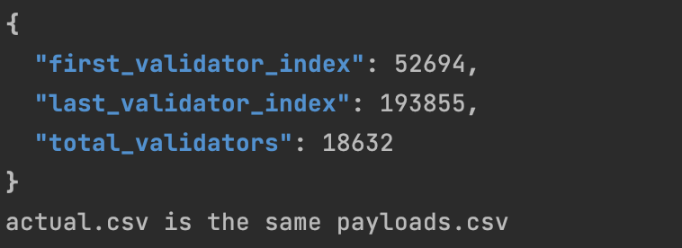

# How to get signatures of BlsExecutionChange container.

Ethereum staking started with only one type of withdrawal credential, called 0x0. This allowed only a BLS address type to be the owner of a validator.
In December 2020, the introduction of 0x01 allowed Ethereum addresses to own a validator.
It'd be possible to switch the withdrawal credentials of an existing validator from 0x00 to 0x01 with Capella fork. There are [18,632 Lido validators](./pkg/wc_rotation/payloads.csv) using 0x00 withdrawal credentials.
To rotate them to 0x01, Lido has developed the dc4bc software with recently added batch-signing capability.

### Command
```
./dc4bc_cli sign_baked [dkg_id] [range_start] [range_end]
```
* `dkg_id`: The hash of dkg round.
* `range_start`: "From" index in the [payloads.csv](./pkg/wc_rotation/payloads.csv)
* `range_end`: "Finish" index in the [payloads.csv](./pkg/wc_rotation/payloads.csv)
    #### Example
    `range_start, range_end` - are sequence numbers of the validators in the file, not their indexes.
    ```
    $ ./dc4bc_cli sign_baked d62c6c478d39d4239c6c5ceb0aea6792 0 100
    $ ./dc4bc_cli sign_baked d62c6c478d39d4239c6c5ceb0aea6792 100 500
    ...
    $ ./dc4bc_cli sign_baked d62c6c478d39d4239c6c5ceb0aea6792 18000 18632
    ```

### Eth variables and them to check
For rotation 0x00 withdrawal credential to 0x01, it needed to send a [SignedBLSToExecutionChange](https://github.com/ethereum/consensus-specs/blob/dev/specs/capella/beacon-chain.md#signedblstoexecutionchange) to the eth network.
```python
class SignedBLSToExecutionChange(Container):
    message: BLSToExecutionChange
    signature: BLSSignature
```
Filling up [SignedBLSToExecutionChange](https://github.com/ethereum/consensus-specs/blob/dev/specs/capella/beacon-chain.md#signedblstoexecutionchange) requires another container 
[BlsToExecutionChange](https://github.com/ethereum/consensus-specs/blob/dev/specs/capella/beacon-chain.md#blstoexecutionchange) and his signature.
```python
class BLSToExecutionChange(Container):
    validator_index: ValidatorIndex
    from_bls_pubkey: BLSPubkey
    to_execution_address: ExecutionAddress
 ```
* [ValidatorIndex](https://github.com/ethereum/consensus-specs/blob/5337da5dff85cd584c4330b46a881510c1218ca3/specs/phase0/beacon-chain.md#custom-types) - uint64 a validator registry index
* [BLSPubkey](https://github.com/ethereum/consensus-specs/blob/5337da5dff85cd584c4330b46a881510c1218ca3/specs/phase0/beacon-chain.md#custom-types) - Bytes48 a BLS12-381 public key
* [ExecutionAddress](https://github.com/ethereum/consensus-specs/blob/6181035d5ddef4b668d0fcfee460da9888009dd9/specs/bellatrix/beacon-chain.md#custom-types) - Bytes20	Address of account on the execution layer
* [BLSSignature](https://github.com/ethereum/consensus-specs/blob/5337da5dff85cd584c4330b46a881510c1218ca3/specs/phase0/beacon-chain.md#custom-types) - Bytes96	a BLS12-381 signature

Dc4bc contains itself list of validator indexes embedded in [payload.csv](./pkg/wc_rotation/payloads.csv). Also, dc4bc predefined other values hex formatted and unit tests for them, such as:

* [GenesisForkVersion](https://github.com/ethereum/consensus-specs/blob/5337da5dff85cd584c4330b46a881510c1218ca3/specs/phase0/beacon-chain.md#genesis-settings):
  * ``0x00000000``
  * ``[4]byte{0, 0, 0, 0}``
* [DomainBlsToExecutionChange](https://github.com/ethereum/consensus-specs/blob/dev/specs/capella/beacon-chain.md#domain-types): 
    * ``0x0A000000``
    * ``[4]byte{10, 0, 0, 0}``
* [LidoBlsPubKeyBB](https://blog.lido.fi/lido-withdrawal-key-ceremony/)
  * base64 ``tnrKcfBLZzA3tUAJt2Dxlh84NuVxQUHIkq/bdewINNzmeE2ccu2K19syjP+P6fE+``
  * hex ``0xb67aca71f04b673037b54009b760f1961f3836e5714141c892afdb75ec0834dce6784d9c72ed8ad7db328cff8fe9f13e``
  * bytes ``[48]byte{182, 122, 202, 113, 240, 75, 103, 48, 55, 181, 64, 9, 183, 96, 241, 150, 31, 56, 54, 229, 113, 65, 65, 200, 146, 175, 219, 117, 236, 8, 52, 220, 230, 120, 77, 156, 114, 237, 138, 215, 219, 50, 140, 255, 143, 233, 241, 62}``
* [ExecutionAddress](https://mainnet.lido.fi/#/lido-dao/0x2e59a20f205bb85a89c53f1936454680651e618e/vote/78/)
  * ``0xb9d7934878b5fb9610b3fe8a5e441e8fad7e293f``
  * ``[20]byte{185, 215, 147, 72, 120, 181, 251, 150, 16, 179, 254, 138, 94, 68, 30, 143, 173, 126, 41, 63}``
* [GenesisValidatorRoot](https://ethereum.github.io/beacon-APIs/#/Beacon/getGenesis)
  * ``0x4b363db94e286120d76eb905340fdd4e54bfe9f06bf33ff6cf5ad27f511bfe95``
  * ``[32]byte{75, 54, 61, 185, 78, 40, 97, 32, 215, 110, 185, 5, 52, 15, 221, 78, 84, 191, 233, 240, 107, 243, 63, 246, 207, 90, 210, 127, 81, 27, 254, 149}``

Each value covered by unit test [here](./pkg/wc_rotation/variables_test.go)

### How we've collected [payloads.csv](./pkg/wc_rotation/payloads.csv).
The validator's list was collected by [wc-collector](https://github.com/sergeyWh1te/wc-collector). It searches validator indexes with 0x00 Lido's wc([0x009690e5d4472c7c0dbdf490425d89862535d2a52fb686333f3a0a9ff5d2125e](https://mainnet.lido.fi/#/lido-dao/0x2e59a20f205bb85a89c53f1936454680651e618e/vote/0/)) and stores them into db.
Image with data can be found in [one docker hub](https://hub.docker.com/r/snack008/wc-exchange-postgres).The data with validator indexes has been saved in [payload.csv](./pkg/wc_rotation/payloads.csv)

### How to test payload.csv
Dc4bc contains itself [payload_csv_test.sh](./pkg/wc_rotation/payload_csv_test.sh). For his work, it's required to install utility
[jq](https://stedolan.github.io/jq/download/) for your os. Also, when you run the script, it asks from a user ``Please provide consensus layer node host``.

During working [payload_csv_test.sh](./pkg/wc_rotation/payload_csv_test.sh), it fetches data with all validators in ETH blockchain. Then filters validators with Lido's 0x00 wc ([0x009690e5d4472c7c0dbdf490425d89862535d2a52fb686333f3a0a9ff5d2125e](https://mainnet.lido.fi/#/lido-dao/0x2e59a20f205bb85a89c53f1936454680651e618e/vote/0/))
Stores filtered data into `actual.csv` and using `diff` shows the difference between `actual.csv` and `payload.csv`. To pass a test, the content must be the same.

Here's an example of a successful result.
