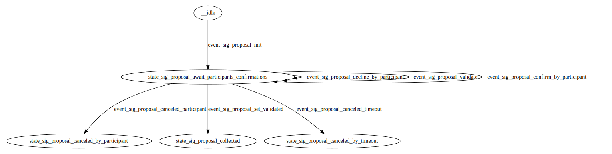
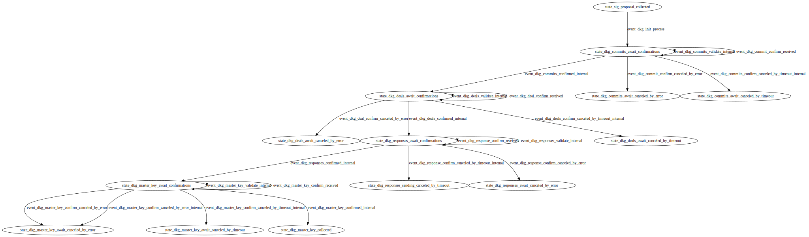
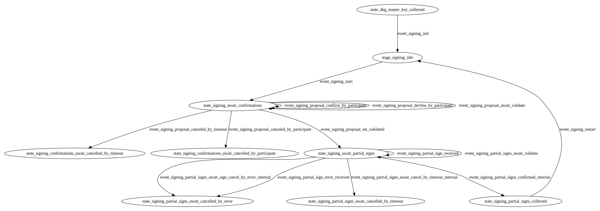

# Finite-state machines description

We moved away from the idea of one large state machine that would perform all tasks, so we divided the functionality into three separate state machines:
* SignatureProposalFSM - responsible for collecting agreements to participate in a specific DKG round
* DKGProposalFSM - responsible for collecting a neccessary data (pubkeys, commits, deals, responses and reconstructed pubkeys) for a DKG process
* SigningProposalFSM - responsible for signature process (collecting agreements to sign a message, collecting partial signs and reconstructed full signature)

We implemented a FSMPoolProvider containing all three state machines that we can switch between each other by hand calling necessary events.

## Visual representation of FSMs
### SignatureProposalFSM

### DKGProposalFSM

### SigningProposalFSM

